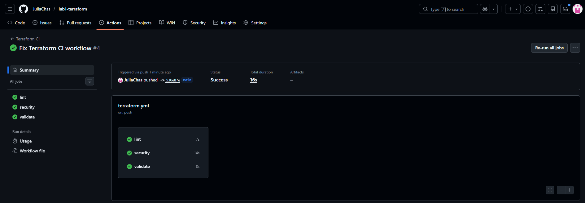
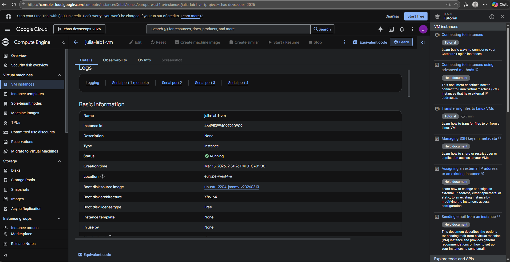
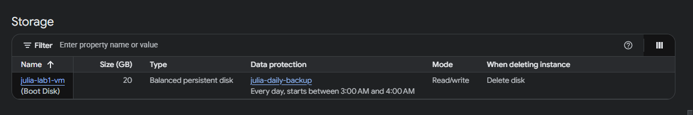

# Lab1 Terraform

## Vad projektet gör
I detta projekt använder jag Terraform för att automatiskt skapa en virtuell Linux-server i Google Cloud Platform. Syftet är att visa hur man kan hantera infrastruktur som kod istället för att skapa resurser manuellt i ett webbgränssnitt.

Terraform-konfigurationen skapar en Ubuntu-baserad virtuell maskin. Den konfigurerar några grundläggande säkerhetsåtgärder via ett startup-script och sätter upp en backup-strategi med snapshots. Projektet innehåller också en CI-pipeline i GitHub Actions som automatiskt kontrollerar Terraform-koden varje gång ändringar pushas till repot.

## Hur man kör projektet
För att köra projektet lokalt används Terraform.

### 1. Initiera Terraform
Detta laddar ner nödvändiga providers och förbereder projektet.
terraform init

### 2. Se vad som kommer skapas
Detta kommando visar vilka resurser Terraform planerar att skapa.
terraform plan

### 3. Skapa infrastrukturen
Detta kommando skapar den virtuella maskinen i Google Cloud.
terraform apply

## CI/CD Pipeline
Projektet använder GitHub Actions för att automatiskt kontrollera Terraform-koden.

Varje gång kod pushas till repot körs tre kontroller.

### Lint
Kontrollerar att Terraform-koden är korrekt formatterad.

### Security Scan
En säkerhetsskanning körs med Trivy för att upptäcka potentiella säkerhetsproblem i konfigurationen.

### Validate
Terraform kontrollerar att konfigurationen är korrekt skriven och kan användas för att skapa infrastrukturen.

---

## Screenshot – Pipeline

---

## Screenshot – Virtuell maskin i GCP

---

## Backup-strategi
I projektet har jag lagt till en snapshot-policy i Terraform som automatiskt skapar backups av VM-disken.

Backups tas en gång per dag och sparas i sju dagar.  
Det gör att data kan återställas om något skulle gå fel med servern.

## Disaster Recovery

### RPO – Recovery Point Objective
RPO beskriver hur mycket data som maximalt kan gå förlorad vid ett haveri.
Med dagliga snapshots som tas kl 03:00 är max dataförlust **24 timmar**.

### RTO – Recovery Time Objective
RTO beskriver hur snabbt infrastrukturen kan återställas.
Med Terraform kan hela infrastrukturen återskapas på **några minuter** genom att köra `terraform apply`.

### Återställningsscenario
**Om VM:en försvinner eller kraschar:**
1. Kör `terraform apply` — Terraform återskapar VM:en från scratch automatiskt.
2. VM:en startar upp med samma konfiguration och startup-script som tidigare.

**Om data på disken försvinner:**
1. Gå till GCP Console → Snapshots
2. Hitta senaste snapshot (max 24h gammal)
3. Kör `gcloud compute disks create restored-disk --source-snapshot=SNAPSHOT_NAME`
4. Koppla den återställda disken till VM:en

## Säkerhetsbeslut
När servern startas körs ett startup-script som installerar och aktiverar några grundläggande säkerhetsfunktioner.

### UFW
Brandväggen konfigureras för att blockera all inkommande trafik som standard och endast tillåta SSH.

### Fail2Ban
Fail2Ban hjälper till att skydda mot brute-force-attacker genom att blockera IP-adresser som försöker logga in många gånger med fel lösenord.

### Unattended Upgrades
Automatiska säkerhetsuppdateringar aktiveras så att servern får viktiga säkerhetsuppdateringar utan manuell hantering.